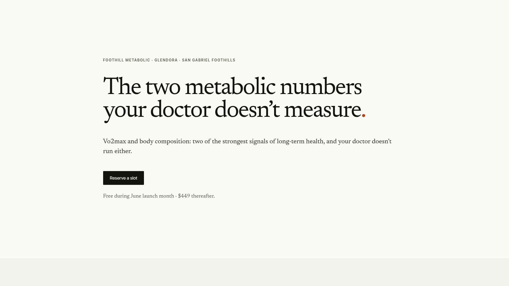

# DESIGN.md: Foothill Metabolic (reference)

## Source
- URL: https://foothillmetabolic.com/
- Capture date: 2026-06-09
- Evidence: Firecrawl `branding` JSON + full-page screenshot + markdown
- Artifacts: `docs/foothill-reference.png`, `../../.firecrawl/foothillmetabolic-branding.json`, `../../.firecrawl/foothillmetabolic.md`

## Reference Screenshot


This is the canonical visual reference for `apps/www`. Tokens below describe the same page in machine-readable form. Use the screenshot as the source of truth for layout, hierarchy, density, and feel.

## Design Summary
Editorial. Generous whitespace. Cream paper background with a single near-black ink. A serif headline that's deliberately oversized and tight-leaded, set left of a wide column. A single tiny burnt-orange accent (one period) carries the entire palette. Body copy is small, deliberate, declarative. CTAs are square-cornered black blocks — flat, no shadows, no gradients. The aesthetic is "literary brochure, not SaaS landing page": text-first, minimal imagery, no glassmorphism, no rounded everything.

## Design Tokens

### Colors
| Role | Hex | Notes |
| --- | --- | --- |
| `bg.page` | `#FBFAF7` | Cream paper |
| `bg.subtle` | `#F3EFE5` | Inferred — slightly warmer band used between sections |
| `text.primary` | `#2D2C25` | Espresso black, not pure black |
| `text.muted` | `#6B6759` | Warm gray for eyebrows, captions, meta |
| `border` | `#DCD6C7` | Warm tan rule line / input border |
| `button.bg` | `#14140F` | Near-black button fill |
| `button.fg` | `#FBFAF7` | Cream on button |
| `accent` | `~#C9572D` | Burnt orange / sienna — used as a single dot in the headline |

Confidence: high for primary roles (extracted from branding scrape, observed in screenshot). `bg.subtle` is inferred from the lower band in the screenshot.

### Typography
- **Headings:** `Newsreader` (Google Fonts) — serif, low-contrast, slight humanist warmth. Fallback chain `Newsreader, "Iowan Old Style", Georgia, "Source Serif Pro", "Times New Roman", serif`.
- **Body:** Same serif (`Newsreader` / Georgia) at small sizes for editorial unity. Many landing sections also use a sans (likely `Inter Tight`) for eyebrows and meta labels.
- **Eyebrow / meta:** `Inter Tight`, uppercase, tracked (`letter-spacing ~0.08em`), small (12–14px). Color = `text.muted`.

Type scale (observed):
| Token | Size (desktop) |
| --- | --- |
| `display` | 90px / 0.95 line-height — used for the single hero headline |
| `h2` | 54px |
| `h3` | ~32px (inferred) |
| `body` | 24.75px (large editorial paragraph) — drops to ~18px in dense sections |
| `meta` | 13–14px |

Weights: body 400, headings 500 (no 700 black). Headings often slightly italicized terminal punctuation (the orange period).

### Spacing And Layout
- 8px base unit. Section padding ~120–160px vertical on desktop.
- Single-column, max-width ~720–880px for text blocks. Hero block sits at ~960–1040px.
- Border radius **2px** on inputs, **2px** on buttons. Nothing is pill-shaped.
- No shadows. No card gradients. Section dividers are either a soft band of `bg.subtle` or a 1px `border` rule.
- Grid: mostly stacked. Some sections use a 2-column "label on left, paragraph on right" arrangement at desktop, collapsing to one column on mobile.

## Components

### Buttons
- **Primary:** background `#14140F`, text `#FBFAF7`, padding `14px 22px`, border-radius `2px`, font-size 16px, weight 500. No shadow. Hover: lighten background by ~6% or shift to `#2A2A22`.
- No secondary button observed. If we need one: outlined `1px solid border` on `bg.page` with `text.primary`.

### Inputs
- Background `#FBFAF7`, border `1px solid #DCD6C7`, radius `2px`, no shadow. Label above input in `text.muted` small uppercase.

### Sections
- Eyebrow → headline → paragraph → optional CTA. Eyebrow is the only sans-serif text in many sections. Section spacing uses big vertical rhythm — 96–160px top padding.

### Footer
- Quiet. One-line description, address, single tagline. `text.muted`, small.

## Page Patterns
1. **Hero** — `eyebrow → oversized serif headline (with single colored period) → 1–2 sentence subhead → primary CTA → small meta line`. Center-aligned to the column, content sits ~25% from the top of the viewport.
2. **Two-claim section** — `H2 + two paragraphs explaining the wedge`. Sets up "why this exists".
3. **What you get** — sub-blocks each with `H3 + paragraph + example chart/data visual`.
4. **Positioning** — short manifesto paragraph clarifying what the product is *not*.
5. **Who this is for** — 3 column or stacked list of audience archetypes (eyebrow + paragraph each).
6. **FAQ** — collapsible Q&A list. Plus icon, no chevrons, no card backgrounds.
7. **CTA / form** — short form, single column, primary button beneath, repeat meta line.
8. **Footer** — quiet, single line.

## Content Style
- Declarative sentences. No marketing puffery. No "world-class", no "powerful", no "seamless".
- Uses domain language directly (Vo2max, lean mass, FHIR, A1C) — assumes the reader is curious and willing to be precise.
- CTAs are verb + noun: "Reserve a slot", "Schedule a session".
- Numbers are highlighted in bold, not in coloured pill chips.
- Frames the offering as "the thing your X doesn't give you" — opposition / wedge framing.

## Agent Build Instructions
When constructing `apps/www`:
1. Use Next.js 14 App Router with global CSS + minimal CSS custom properties for tokens. No Tailwind, no Mantine. Component-level CSS Modules where needed.
2. Load `Newsreader` and `Inter Tight` via `next/font/google`.
3. The hero must dominate the first viewport: 90px headline, ~960px column, single sentence subhead, one CTA, one meta line. The orange "." accent goes on the **last period of the H1**.
4. Sections should breathe. Default `padding-block: clamp(80px, 12vw, 160px)`.
5. Buttons are 2px-rounded, near-black, no shadow, ~14×22 padding.
6. Avoid stock SaaS visuals (gradients, glass, neumorphism). Prefer text-first sections; reserve images for product screenshots.
7. Use the eyebrow pattern (`Inter Tight`, 12–14px, `text-transform: uppercase`, tracked, `text.muted`) above every H2.
8. Footer stays quiet — one row, muted text, no nav.
9. Do not include third-party logos or imagery from Foothill. We're cloning the *system*, not the brand.

## Rerun Inputs
```
workflow: firecrawl-website-design-clone
source_url: https://foothillmetabolic.com/
target_stack: Next.js 14 App Router
output: DESIGN.md
```
