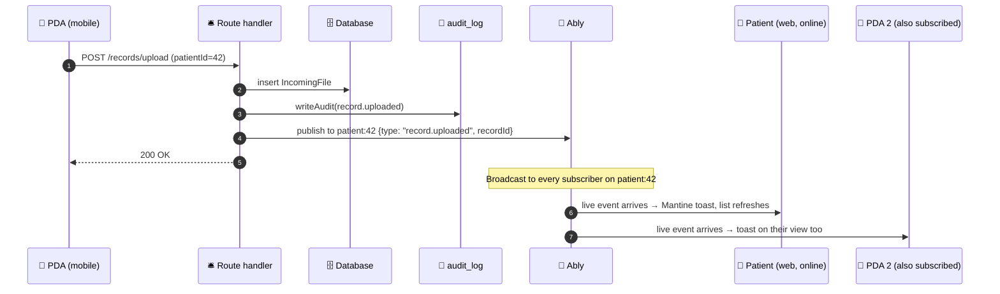

# 02 — Target architecture overview

## The plain-English version: bulletin board, not bellhop

Imagine a small apartment building. Every resident (user) has a mailbox (the existing email system, already wired up). The building also has a **bulletin board in the lobby** where the super pins notices like "package for unit 3B" or "elevator out for an hour." Anyone walking through the lobby sees the notices that apply to them.

That's the whole architecture:

| Real thing | In our system |
|---|---|
| **Resident** | A user (Patient, PDA, or Agent) |
| **Mailbox** | Resend email — already in `lib/email.ts`; route handlers call `sendXEmail()` inline, exactly as today |
| **Bulletin board** | An Ably channel — `patient:{id}` for things the patient + their PDAs all care about, `user:{id}` for personal notices |
| **Pinning a notice** | `publishEvent({ type, scope, payload })` from a route handler |
| **Logbook the super keeps** | `audit_log` table — every event publish, every channel subscription, every email send, every PDA data read |
| **A notice that says "only 3B should act on this"** | Recipient envelope: `recipientIds: ["user_3B"]` — other residents see the notice exists but their app ignores it |

There is no central router, no presence ledger, no bellhop, no waitUntil, no queue, no retry layer. A route handler does its work, calls `publishEvent` (one fire-and-forget Ably publish), calls `sendXEmail` if the flow requires email, and returns. That's it.

## Flow

```mermaid
flowchart LR
  USER[👤 User does something<br/>e.g. PDA uploads a record] --> ROUTE[🛎️ Route handler]
  ROUTE -->|insert + commit| DB[(🗄️ Database)]
  ROUTE -->|writeAudit| AUDIT[(📓 audit_log)]
  ROUTE -->|publishEvent — fire-and-forget| ABLY{{📡 Ably}}
  ROUTE -->|sendXEmail — inline, today| RESEND[✉️ Resend]
  ROUTE -->|200 OK| USER

  ABLY --> WEB["💻 Patient web client<br/>shows toast"]
  ABLY --> MOB["📱 Patient mobile<br/>shows toast"]
  ABLY --> PDA1["💻 PDA 1<br/>subscribed to same patient:&#123;id&#125;"]
```

Notice what's **not** in the diagram: no router box, no presence box, no fanout loop, no dedup table, no preferences lookup. Each side-effect is a single line in the route handler.

## Worked example: PDA uploads a record for a patient

PHI never leaves authenticated REST. The Ably message is `{ type, recordId, patientId, byUserId }` — IDs only. Anyone receiving the event refetches via the existing REST endpoint, where row-level auth runs as it does today.

## Channel taxonomy at a glance

| Channel | Who subscribes | What's published there |
|---|---|---|
| `user:{userId}` | That user only | Personal account events (security alerts, suspension, PDA invite received) |
| `patient:{patientId}` | Patient + every accepted PDA + assigned agents | All patient-scoped events (records, releases, providers, profile, permissions) |
| `release:{releaseId}` | Anyone with patient access on the release page | Page-scoped collaboration |
| `document:{documentId}` | Anyone with patient access on the document page | Page-scoped collaboration |
| `provider:{providerId}` | Anyone with patient access on the provider page | Page-scoped collaboration |
| `chat:{chatId}` | (placeholder for future chat feature) | — |

Channel names live in `packages/types/src/schemas/events.ts` via `channelNameFor(scope)`. Clients never construct channel names directly.

## Why this shape (and why no router)

| Original full-fat design | Simplified v2 |
|---|---|
| Route handler calls `publishEvent`; publisher hands off to a `waitUntil` router that decides which channels fire (in-app vs push vs email vs SMS), checks user preferences, dedups against `notification_log`, and queries presence. | Route handler calls `publishEvent` (Ably only) and `sendXEmail` (inline) directly. No router. No `notification_log`. No `notification_preferences`. No presence lookup. No dedup. |
| Four notification surfaces × dedup × prefs × presence × audit ≈ a lot of code and three new tables. | One Ably publish + the existing email call + one `audit_log` write. No new behavior tables. |
| BAA + provider choice matters; PHI could theoretically appear in payloads. | "No PHI on the wire" invariant unchanged; payload is always IDs. The simplification doesn't loosen this guarantee. |

The router can be added back later as a single module the route handler delegates to, *if* push/SMS land and need shared logic. Until then, the cost of building it is not justified.

## The three boundaries that keep this clean

1. **Route handlers always call `publishEvent` (never Ably SDK directly) and `writeAudit` (never `db.insert(auditLog)` directly).** One choke point per concern.
2. **Realtime payloads are always ID-only.** "Record 47892 changed — go look." Never the record's contents. Keeps PHI off the wire regardless of vendor BAA status.
3. **`audit_log` is append-only.** No code updates or deletes rows; the only delete path is the future archival job (separate credential).

Holding these three lines keeps every later evolution local: adding push back later, swapping Ably for Soketi, piping audit into Axiom — each is one module change, not a refactor.
