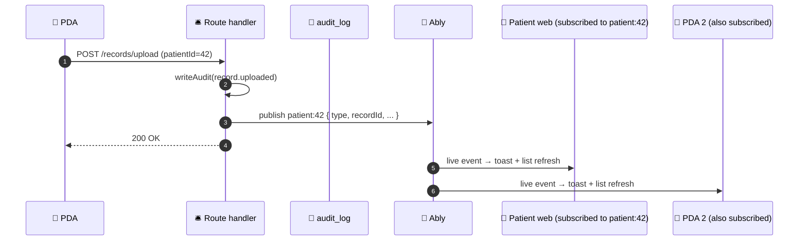

# 07 — Channels & subscription model (v2)

> **v2 note**: presence is **out of scope** for v1 (it was needed only to drive the router's "skip push if user is online" rule, and there's no router anymore). The rest of this chapter — channel naming, channel auth, recipient envelope — is the active spec.

## Channel naming

```
user:{userId}           — strictly 1:1; that user's personal events
patient:{patientId}     — patient + every accepted PDA + assigned agents
release:{releaseId}     — joined on UI navigation (release page open)
document:{documentId}   — joined on UI navigation (document page open)
provider:{providerId}   — joined on UI navigation (provider page open)
chat:{chatId}           — placeholder for future chat feature
```

The channel-name string is the single source of truth and is built by `channelNameFor(scope)` in `packages/types/src/schemas/events.ts`. Clients never construct channel names directly — they get a `scope` from the server and pass it to the subscribe helper.

## Why `patient:{id}` and not per-user fanout

In v1 of the plan, a `record.uploaded` event would have been fanned out by the router to `user:{patient}`, `user:{pda1}`, `user:{pda2}`, ... — one publish per recipient.

In v2, the server publishes **once** to `patient:{patientId}`. Patient + every accepted PDA + assigned agents are already subscribed because they have channel-auth for that patient (see below). Benefits:

- ~2–5× fewer Ably channel writes per event at the scale of "patient with several PDAs"
- No server-side fanout loop to maintain
- The channel membership IS the audience — no separate audience computation

## Channel auth

Every `subscribe` request hits `POST /api/realtime/auth`:

1. The caller's session is resolved (existing `auth-helpers`).
2. For each requested channel, `canAccessChannel(session, channelName)` runs:

| Channel | Allowed when |
|---|---|
| `user:{id}` | `session.user.id === id` |
| `patient:{id}` | `session.user.id === id` (the patient subscribing to their own channel), OR a row exists in `patientDesignatedAgents` with `patientId=id, agentUserId=session.user.id, status='accepted'`, OR `session.user` is an assigned Zabaca agent for the patient |
| `release:{id}` | Resolve `release.id → patientId`; apply `patient:{patientId}` rule |
| `document:{id}` | Resolve `document.id → patientId`; apply `patient:{patientId}` rule |
| `provider:{id}` | Resolve `provider.id → patientId`; apply `patient:{patientId}` rule |
| `chat:{id}` | TBD with the chat feature |

3. The handler returns an Ably token with `capability: { "<granted channel>": ["subscribe"] }`. Denied channels do not appear in the capability map; the client receives a per-channel granted/denied list.
4. Token TTL is ≤60s. Clients auto-refresh.
5. **Every issuance is audit-logged.** Granted → `eventType=channel.granted, status=granted`. Denied → `eventType=channel.denied, status=denied`.

## Recipient envelope (UX filter)

Some events on a shared channel are meant for a specific subscriber (e.g., "PDA #2 viewed your records" — the patient should react, other PDAs should not). The payload carries an optional `recipientIds` field:

```ts
{
  type: "record.viewed_by_pda",
  recipientIds: ["user_patient_42"],   // optional; UX filter only
  ts: 1737000000000,
  payload: { recordId: "rec_xyz", patientId: "user_patient_42", byUserId: "user_pda_2" }
}
```

Client subscriber rule:
- If `recipientIds` is absent → render the event.
- If `recipientIds` is present and the local user ID is in it → render.
- If `recipientIds` is present and the local user ID is NOT in it → drop silently.

This is a **UX correctness** mechanism, not a security boundary. The actual authorization gates are at subscribe time (above) and at REST-fetch time (existing route-level auth). The envelope only prevents the wrong client from showing the wrong toast.

We deliberately chose this over per-recipient encryption: payloads carry no PHI (only IDs + event names), so the "metadata leak" of "an event existed" to non-recipient subscribers is acceptable — they already have channel-auth to know events on that patient exist.

## Sequence — record uploaded by PDA



PHI does not flow on the channel. Both subscribers receive `{ type, recordId, patientId, byUserId }` and refetch the record via the existing authenticated REST endpoint.

## Subscription lifecycle (client)

On sign-in or app open:
1. Client calls `POST /api/realtime/auth` with the channels it wants: always `user:{me}`, plus `patient:{id}` for each patient the user has access to (own patient + every patient they're a PDA for).
2. Client receives a token; connects to Ably; subscribes to the granted channels.
3. On route change to a release/document/provider page: client calls auth again to add `release:{id}` (etc.) to its subscription set.
4. On route exit: client unsubscribes from page-scoped channels.
5. On logout: client disconnects.

Token refresh runs ~50s into the 60s TTL.

## What's removed from v1 of this chapter

- "Presence" section — built-in Ably presence is unused in v1 (no router rule consumes it). If a future feature wants "X is editing this release," presence comes back as a page-scoped feature on `release:{id}`.
- The sequence diagram showing presence-driven branching (online → in-app; offline → push+email).
