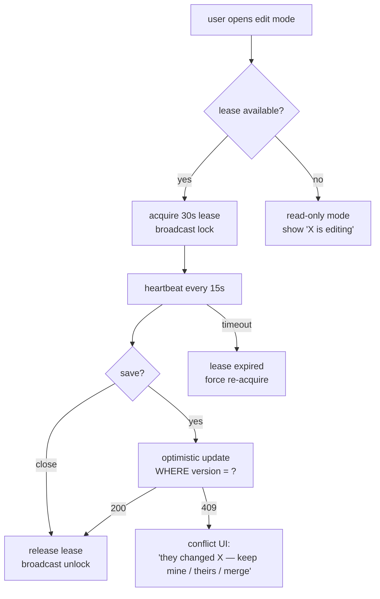

# 08 — Collision mitigation (deferred)

> **v2 note: this whole chapter is deferred.** The v1 simplification covers in-app realtime + email only. Collision mitigation (optimistic locking, atomic signature endpoint, soft edit leases, CRDT) is a separate workstream that does not depend on the notification work and can land in any later phase. Content below is kept as the reference design.

Three layers, ordered by ROI.

## 8.1 Optimistic locking — phase 3a

Add a `version int not null default 1` column to: `users`, `releases`, `incomingFiles`, `userProviders`, `patientDesignatedAgents`.

Update pattern:

```sql
UPDATE releases SET ..., version = version + 1, updated_at = now()
WHERE id = $1 AND version = $2
RETURNING id;
```

If `RETURNING` is empty → 409 Conflict. Client refetches, shows merge UI, retries with new version.

All clients send the `version` they last loaded as part of any update body. Drizzle migration backfills `version = 1`.

## 8.2 Atomic signature — phase 3a (small, do alongside)

Replace `apps/web/src/app/api/releases/[id]/sign/route.ts:21-37` with a single SQL statement guarded by `WHERE auth_signature_image IS NULL`:

```sql
UPDATE releases SET auth_signature_image = $1, auth_date = $2, auth_expiration_date = $3
WHERE id = $4 AND auth_signature_image IS NULL
RETURNING id;
```

Empty `RETURNING` → 409 "already signed". Closes the existing race bug.

## 8.3 Soft edit leases — phase 3b

For UX-level "PDA Bob is editing this release":

- New table `record_locks { entityType, entityId, userId, leaseExpiresAt, sessionJti }` (or Redis with TTL).
- Client acquires a 30s lease on entering edit mode; heartbeats every 15s while editing; releases on close/blur.
- Other clients subscribing to the same `release:{id}` channel see lease events and render a "view-only — Bob is editing" badge.
- Lease expiry is enforced by the realtime channel + server-side check on save.
- This is **advisory**, not a true mutex. Optimistic locking remains the actual safety net.

## 8.4 CRDT — defer

Only consider Yjs / Automerge if a future feature introduces shared free-text editing (e.g., collaborative care notes). Liveblocks Yjs or `y-postgres` are the obvious paths. Out of scope for now — tracked as Phase 4.

## Edit-mode flow



## Summary

Optimistic locking + atomic signature endpoint = ~80% of the value for a few days of work. Soft leases polish the UX for the remaining 20%. CRDT is a phase-4 concern, only if a feature demands it.
