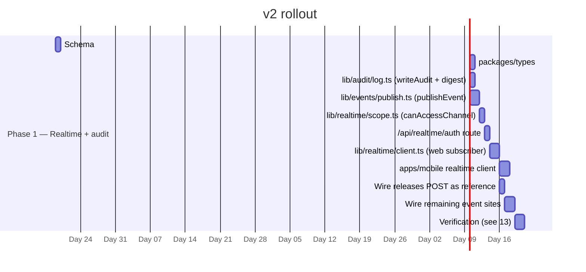

# 09 — Rollout (v2: single phase)

> **v2 note**: v1 of this doc had four phases (foundations → notifications → presence → collision). With the simplification, the notification work collapses to a single phase. Collision mitigation (`08`) becomes a separate workstream, scheduled when product wants it.

## Phase 1 — Ship in-app realtime + audit log

Roughly **~2 weeks of work** end to end.

### Deliverables

- `AuditLog` table + drizzle migration + `writeAudit({ ... })` helper, audit-DB wrapper for future swap to a dedicated Turso database
- Shared event schemas in `@health-agent/types`: `EventType` enum, per-event Zod payload schemas, `channelNameFor(scope)`, `parseChannelName(name)`
- `publishEvent({ type, scope, recipientIds?, payload })` — server entry point; writes audit, fires Ably publish
- `POST /api/realtime/auth` — token issuance, channel-by-channel auth check, audit-log granted/denied
- Web + mobile Ably subscribers — `user:{me}` + every accessible `patient:{id}`; recipient-envelope filter; Mantine/RN dispatch
- Reference wiring at `POST /api/releases` (existing email stays; `publishEvent` added)
- Wiring at the remaining event sites enumerated in `11-files-modules.md`

### Exit criteria

- Open patient web + accepted PDA web in two browsers; PDA uploads a record → both see a live toast + list refresh within ~1s; no other browser context sees it.
- Sign-out and ban tests: revoking a PDA's access removes them from `patient:{id}` on token refresh (within 60s).
- Channel-auth denial path: PDA without permission for patient B requests `patient:{B}` → 403, `AuditLog` row with `status=denied`.
- All existing email flows continue to send unchanged (no regression in Resend behavior).
- `bun run type-check && bun run lint && bun run build` clean at repo root; Metro resolver OK in mobile.

## Future phases (not scheduled)

| Phase | Trigger to schedule |
|---|---|
| Push notifications (mobile Expo + web VAPID) | Product wants alerts when users aren't in-app |
| In-app inbox feed | Users ask for "see what I missed" |
| Per-event email preferences | Users complain about specific email noise |
| Collision mitigation (chapter 08) | Two-user concurrent-edit incident in production |
| Presence on shared pages (release/document) | Collaboration UX work picks up |
| Chat feature on `chat:{id}` | Product decides to build chat |

Each is purely additive: nothing in v1's surface needs to change to add any of them.
